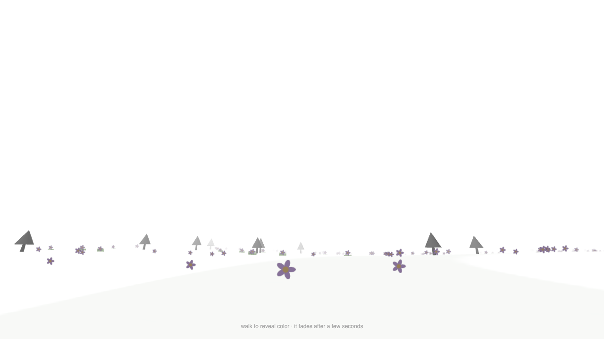

# Baseline measurement — original prototype

Measured 2026-07-26 against `ink-game/ink-garden-world.html`, unmodified.

Method: `npm run measure:baseline`. Real system Google Chrome, headed, hardware GPU,
1280×720, 12 s walking a circle (constant yaw so the player stays inside the world instead
of running into the edge). Headless Chrome was not used — it renders WebGL through
SwiftShader in software and its numbers would be meaningless.

## Numbers

| | p50 | p95 | p99 | worst |
|---|---|---|---|---|
| Frame time, vsync on | 16.70 ms | 17.40 ms | 17.70 ms | 19.20 ms |
| Frame time, vsync off | **2.10 ms** | 3.40 ms | 8.10 ms | 35.20 ms |

- Draw calls: **111 per frame** during the walk (620 objects exist; frustum culling removes
  most). 208 per frame stationary at spawn.
- Pointer lock held for the whole run, 7710 samples uncapped.
- White pixels: 61.5% before entering, 56.8% while walking.
- Console: one 404 (favicon). No app errors.

## What this means

With vsync on the prototype is pinned at a flat 60 fps with zero dropped frames, which tells
you nothing except "it isn't struggling". The uncapped run is the useful one: a frame costs
**2.10 ms out of a 16.67 ms budget — about 12%, roughly 8× headroom.**

That headroom already includes the wasteful parts: the 1024×1024 canvas repaint and ~4 MB
texture re-upload every frame, and 111 un-instanced draw calls. Removing both frees more.

So the density targets (~4,800 flowers, ~14,000 grass tufts, ~400 trees, all instanced down to
under 20 draw calls) are affordable, and there is budget left for the Kuwahara post pass,
which typically costs 1–3 ms.

## Visual observations



From the screenshot, confirming the code review:

1. **It is gray, not white.** Trees read as solid dark silhouettes from across the map. You
   very much do see the world.
2. **Every flower is the same blue.** One petal colour is baked into a single shared 64 px
   canvas at `ink-garden-world.html:132-134`; the `petalColors` array is dead code.
3. **The ground is not visible at all.** The white fog mesh covers it completely, so objects
   float in a void with no horizon and no sense of terrain.
4. **The reveal is tiny.** Two flowers are in colour in the entire frame.
5. **The revealed colour is muted, not saturated.** Multiplying by `0x999999` darkens rather
   than desaturates.

## Reproducing

```
npm run measure:baseline              # capped, includes white-pixel check + screenshot
npm run measure:baseline -- --uncapped  # true frame cost, no vsync wait
```

`--uncapped` skips the screenshot: Playwright waits for a stable compositor frame, which never
arrives when frames render unbounded.
